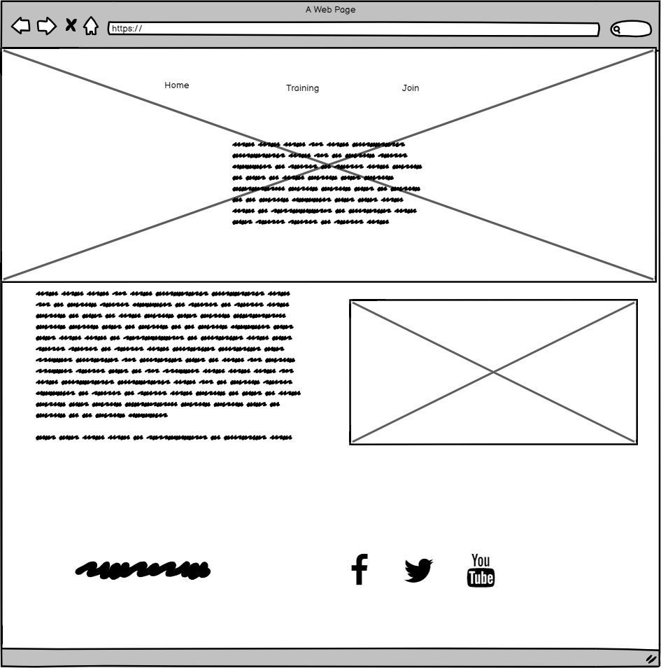
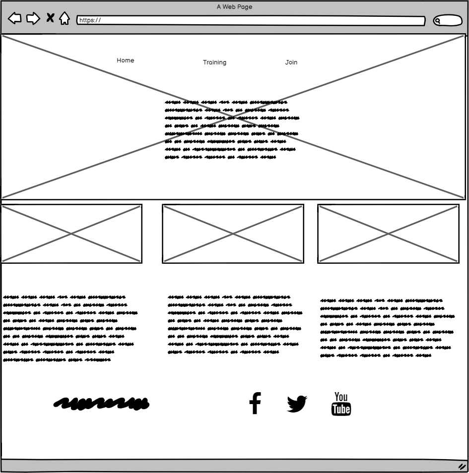
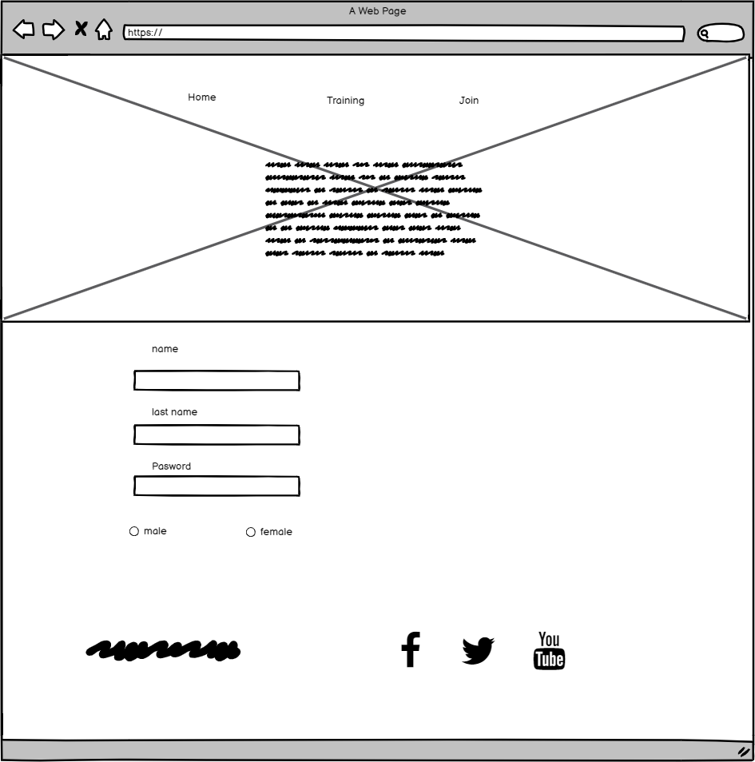
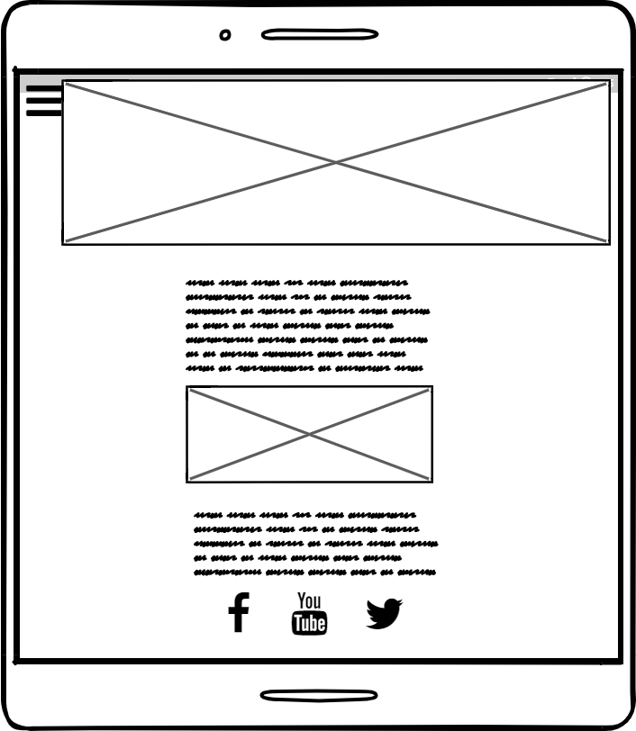
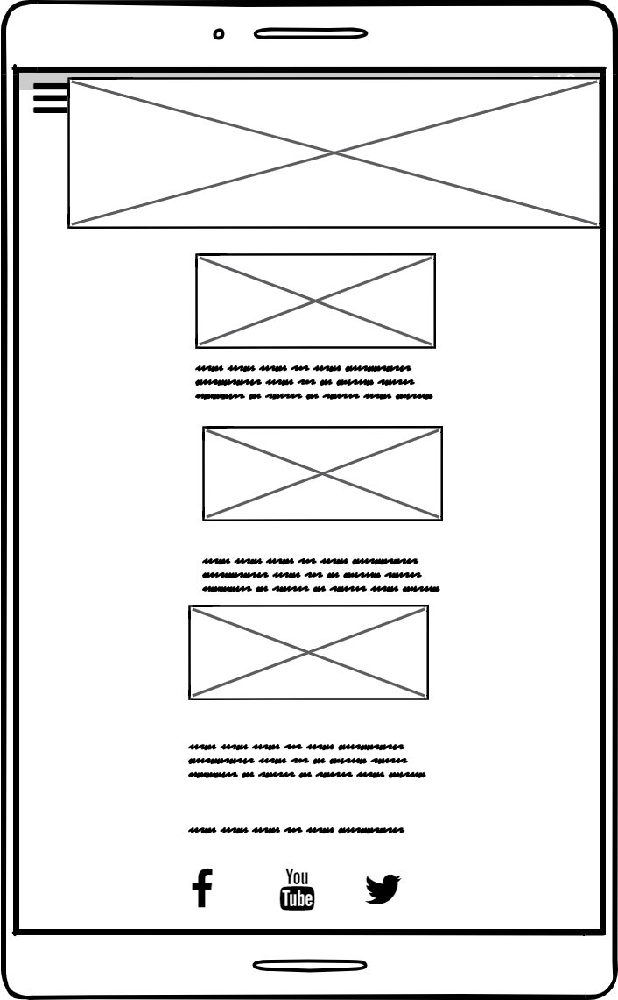
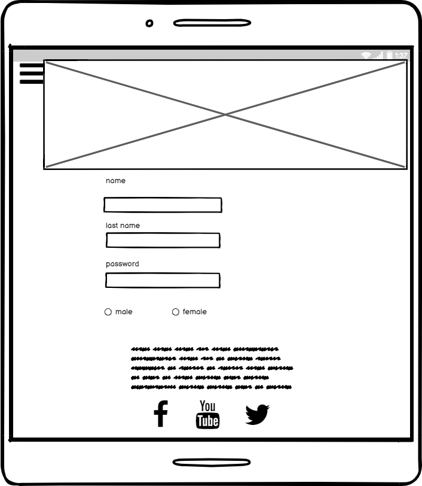
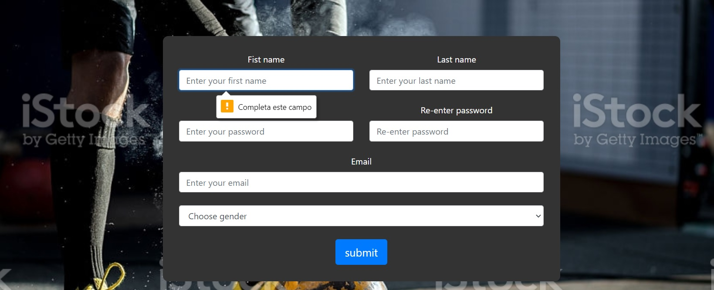
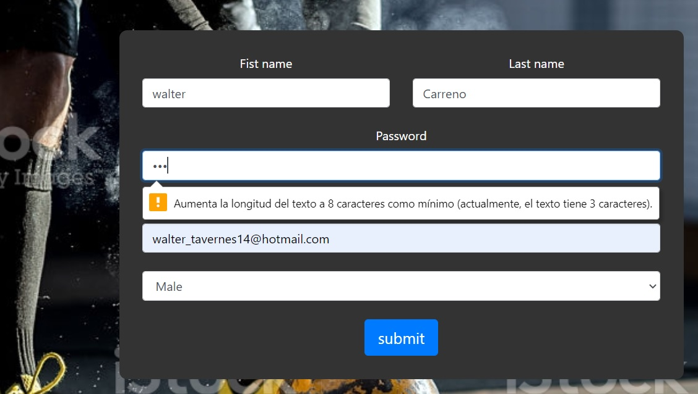
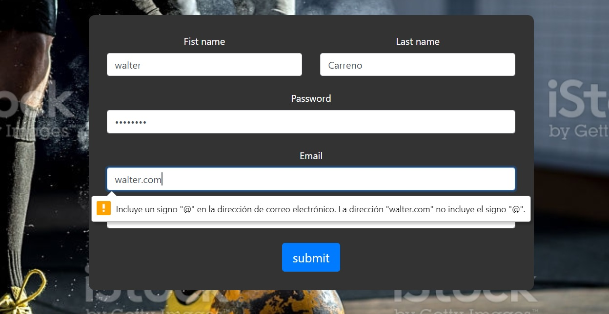

 #  **Welcome to my page.**

 ## **1. Purpose of the project**
With this project I would like to create a website for a gym.

## **2. User stories**
## Gym user
As a gym user I would like to join a gym and know the activities availables.

## Register user

As a registered user I want to know the gym schedule as well as the available activities.

## **3. Features**

The website will consist of 4 pages.
### 1.1 index.html
 - navbar with a hero image.
 - body will have some text and image in the same column.
 - footer will have a text and links to social media.
 
 ### 1.2 training.html

  - navbar with a hero image.
 - body will have three cards.
 - footer will have a text and links to social media.

 ### 1.3 joinus.html

  - navbar with a hero image.
 - body will have the registration form.
 - footer will have a text and links to social media.

 ### 1.4 thank.html

 - Body that will have a thank you message.

## ** 4. Future features**

- Add a new page that will show different activities
- Add [JS](https://es.wikipedia.org/wiki/JavaScript) to make a schedule more interactive.
- Improvement on registration form. 

## **5. Typography and color scheme**

### Fonts.

- Titles,h2 have [Oswald](https://fonts.google.com/specimen/Oswald) font.
Wireframes

-Rest of the text have [sans-serif](https://fonts.google.com/?category=Sans+Serif) font.

### Colors
5.1 Index

- [Navbar elements](https://www.w3docs.com/learn-html/html-nav-tag.html) have [#fafafa](https://www.color-hex.com/color/fafafa) color.
- [h2](https://www.w3schools.com/tags/tag_hn.asp) on the  header have a [#ff0000](https://www.color-hex.com/color/ff0000) color.
- [P](https://www.w3docs.com/learn-html/html-p-tag.html) on the  header have a [#ff0000](https://www.color-hex.com/color/ff0000) color.
- Navbar have a blue background color.
- In the body, [h2](https://www.w3schools.com/tags/tag_hn.asp) have a  [#000000](https://www.color-hex.com/color/000000) color.
- In the body, [P](https://www.w3docs.com/learn-html/html-p-tag.html) and [li](https://www.w3schools.com/tags/tag_li.asp) have a [#696969](https://www.color-hex.com/color/696969) color.
- In the footer, [h3](https://icolorpalette.com/color/fff) color and [P](https://www.w3docs.com/learn-html/html-p-tag.html) have [#fafafa](https://www.color-hex.com/color/fafafa) color.

5.2 Training 

- [Navbar elements](https://www.w3docs.com/learn-html/html-nav-tag.html) have [#fafafa](https://www.color-hex.com/color/fafafa) color.
- [h2](https://www.w3schools.com/tags/tag_hn.asp) on the  header have a [#fafafa](https://www.color-hex.com/color/fafafa) color.
- [P](https://www.w3docs.com/learn-html/html-p-tag.html) on the  header have a [#fafafa](https://www.color-hex.com/color/fafafa) color.
- In The body [P](https://www.w3docs.com/learn-html/html-p-tag.html), [li](https://www.w3schools.com/tags/tag_li.asp) and [h2](https://www.w3schools.com/tags/tag_hn.asp) have [#fafafa](https://www.color-hex.com/color/fafafa) color.
- In the footer, [h3](https://icolorpalette.com/color/fff) color and [P](https://www.w3docs.com/learn-html/html-p-tag.html) have [#fafafa](https://www.color-hex.com/color/fafafa) color.

5.3 Joinus

- [Navbar elements](https://www.w3docs.com/learn-html/html-nav-tag.html) have [#fafafa](https://www.color-hex.com/color/fafafa) color.
- [h2](https://www.w3schools.com/tags/tag_hn.asp) on the  header have a [#fafafa](https://www.color-hex.com/color/fafafa) color.
- [P](https://www.w3docs.com/learn-html/html-p-tag.html) on the  header have a [#fafafa](https://www.color-hex.com/color/fafafa) color.
- In The body, [Registration form elements](https://www.w3schools.com/howto/howto_css_register_form.asp) have a black color.
- In the footer, [h3](https://icolorpalette.com/color/fff) color and [P](https://www.w3docs.com/learn-html/html-p-tag.html) have [#fafafa](https://www.color-hex.com/color/fafafa) color.

5.4 thank
- [P](https://www.w3docs.com/learn-html/html-p-tag.html) have a [#fafafa](https://www.color-hex.com/color/fafafa) color.

## **6.Wireframes**
### Lapton big devices.

 Home page.

 
 Training page.

Joinus page.

### Phone.

 Home page.

 
 Training page.

Joinus page.

## **7. Technology**

- [Css](https://www.w3.org/Style/CSS/Overview.en.html)
- [Html](https://en.wikipedia.org/wiki/HTML)
- [JavaScript](https://en.wikipedia.org/wiki/JavaScript)
- [Balsamiq](https://balsamiq.com/)
- [Font awesome](https://fontawesome.com/v4.7.0/icon/bars)
- [Google font](https://fonts.google.com/)
- [Gitpod](https://www.gitpod.io/)
- [Boostrap](https://getbootstrap.com/docs/4.5/getting-started/introduction/)

## **8. Testing**
 ### 8.1 Testing code
 [Tested](https://jigsaw.w3.org/css-validator/validator?uri=https%3A%2F%2Fwhite-goat-3hbi514l.ws-eu03.gitpod.io%2F%23%2Fworkspace%2Fcss-html&profile=css3svg&usermedium=all&warning=1&vextwarning=&lang=en) 
 ### 8.2 test cases
You have to fill all camps before send the registration form.

Your password must be at least 8 letters long.

You must enter a valid email to register @

## **9. Deployment**
### 9.1 GitHub Pages
The project was deployed to GitHub Pages using the following steps...

1. Log in to GitHub and locate the [GitHub Repository](https://github.com/)
2. At the top of the Repository (not top of page), locate the "Settings" Button on the menu.
3. Scroll down the Settings page until you locate the "GitHub Pages" Section.
4. The page will automatically refresh.
5 .Scroll back down through the page to locate the now published site [link](https://github.com/) in the "GitHub Pages" section.

## Forking the GitHub Repository
By forking the GitHub Repository we make a copy of the original repository on our GitHub account to view and/or make changes without affecting the original repository by using the following steps...

1. Log in to GitHub and locate the GitHub Repository
2. At the top of the Repository (not top of page) just above the "Settings" Button on the menu, locate the "Fork" Button.
3. You should now have a copy of the original repository in your GitHub account.

## 10. Credits
 
 images were taken form [pixabary](https://pixabay.com/es/)

- Code for index.html was taken from [boostrap](https://getbootstrap.com/docs/4.2/getting-started/introduction/)
- Code for training.html was taken from  [boostrap](https://getbootstrap.com/docs/4.2/getting-started/introduction/) and inspired on[youtube](https://www.youtube.com/watch?v=yzRgUUFSGOs&t=182s).
- Code for joinus.html was taken from [boostrap](https://getbootstrap.com/docs/4.2/getting-started/introduction/) and inspired on [youtube](https://www.youtube.com/watch?v=qVGMtFvk1so)
- Code for thank.html was taken from [boostrap](https://getbootstrap.com/docs/4.2/getting-started/introduction/)
- Deployment was taken from [SampleReadme](https://github.com/Code-Institute-Solutions/SampleREADME)